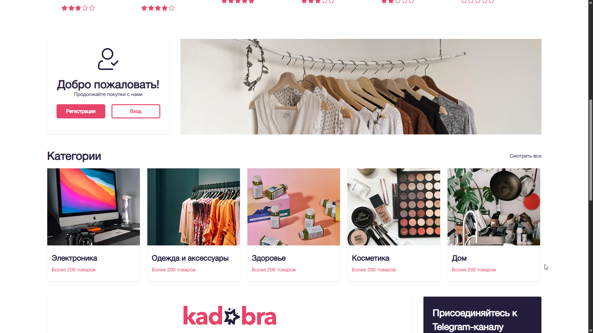
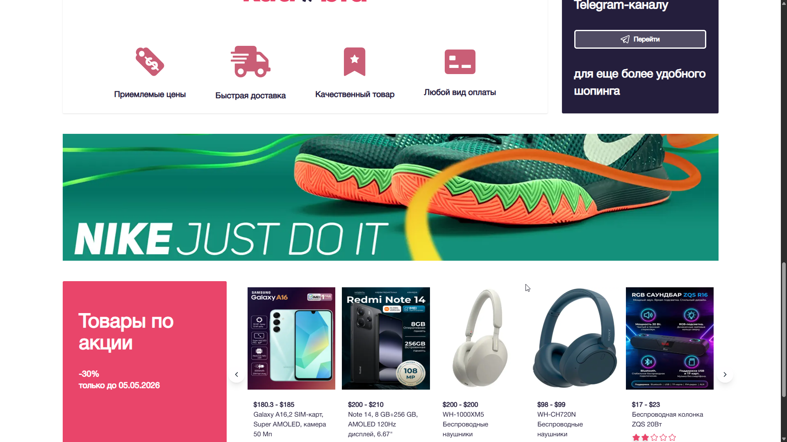
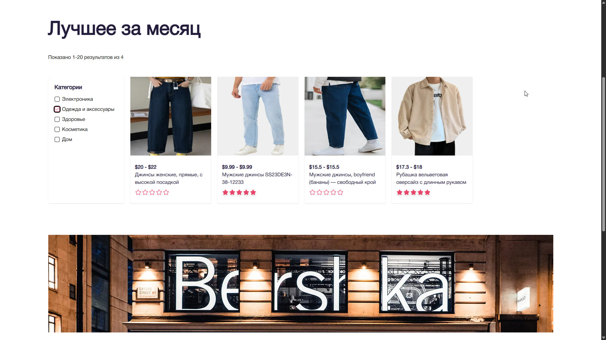
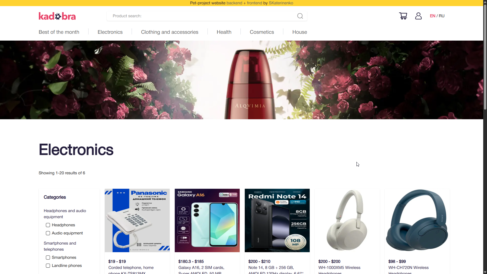
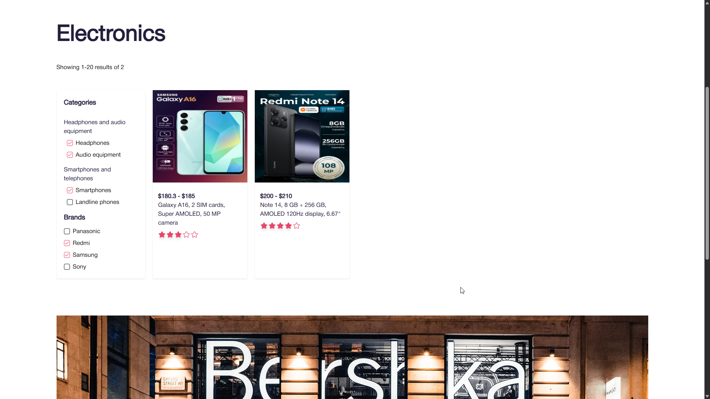
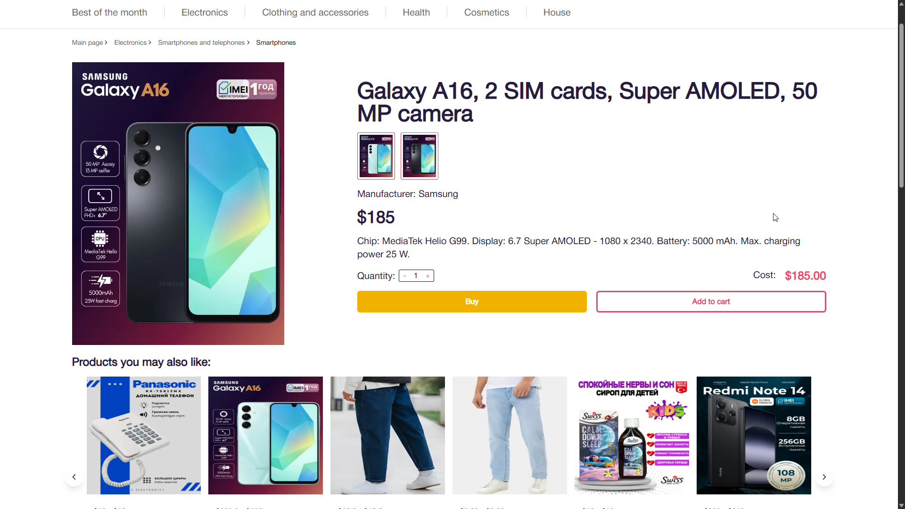
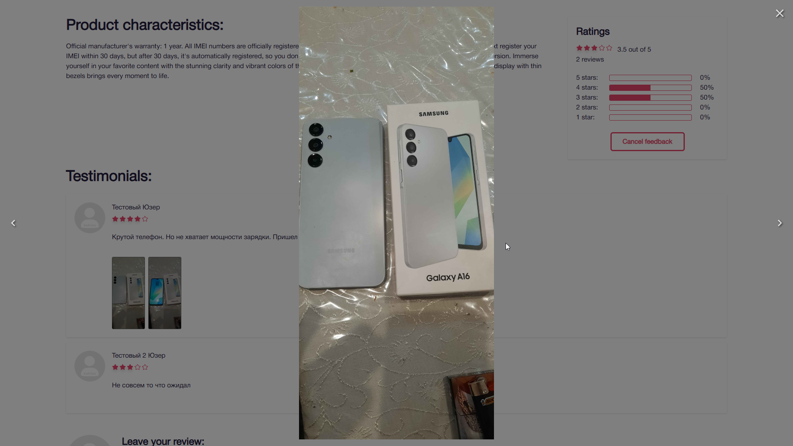
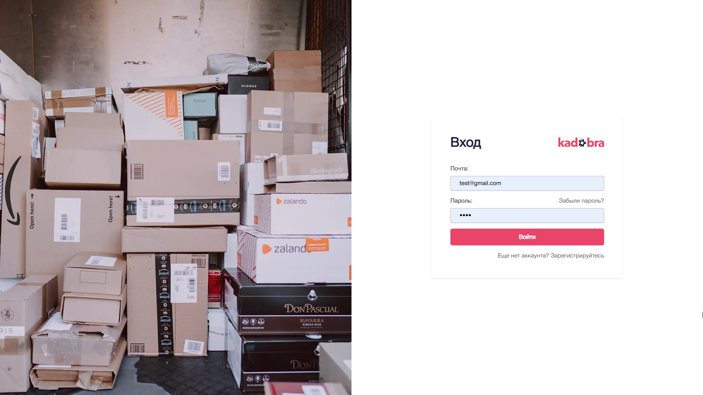

# Kadabra 🪄

**Kadabra** — это pet-проект by SKaterinenko, представляющий собой современное веб-приложение с разделением на backend и
frontend.
Проект создан для практики разработки полноценных сервисов с использованием современных технологий и архитектуры.

## 🚀 Технологии

### Backend https://github.com/SKaterinenko/kadabra-backend

Backend реализован на **Golang** и включает следующие технологии:

* **Golang**
* **PostgreSQL**
* **Redis**
* **S3 (Yandex Cloud Storage)**
* **JWT авторизация**

Backend отвечает за бизнес-логику приложения, аутентификацию пользователей, работу с базой данных и хранение файлов.

### Frontend https://github.com/SKaterinenko/kadabra-frontend

Frontend создан с использованием современного React-стека:

* **Next.js**
* **TypeScript**
* **Tailwind CSS**
* **react-hook-form**
* **next-intl** (интернационализация)

Frontend обеспечивает быстрый интерфейс, удобную работу с формами и поддержку нескольких языков.

## 📦 Архитектура проекта

Проект построен по принципу разделения:

* **Backend API** — обработка данных и бизнес-логика
* **Frontend** — пользовательский интерфейс
* **Redis** — кеширование
* **PostgreSQL** — основная база данных
* **S3 (Yandex)** — хранение файлов

## 🎬 Screenshots

  
  
  
  
  
  
  
  
  

---
